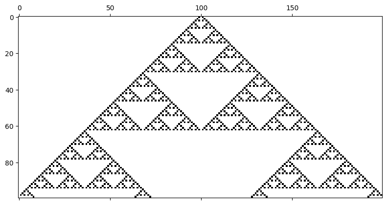

# ndAutomata


Awesome cellular automata library created by Borja Esteban.


## Install it from PyPI

```bash
$ pip install ndautomata
```


## Usage

This package is designed in order to create your own automata definitions based on 2 attributes:

- **neighbours**: List with relative indexes to cell neighbours.
- **states**: Number possible cell states.


```python
from ndautomata import BaseAutomaton, neighbours
```


```python
class Automaton(BaseAutomaton):
    neighbours = neighbours.regular(ndim=1, r=1)
    states = 2
```

> Note the automata dimensions are defined with `neighbours.ndim`.


After you have defined your automaton, you can instantiate automata passing the initial configuration and the rule to the constructor function. Use the module `initializers`, based on [numpy](numpy.org/) to generate the required arrays passing the number of states and size.


```python
from ndautomata import initializers
```


```python
rule = initializers.random(states=2, size=[2, 2, 2])
ic = initializers.center(states=2, size=[200])
ca = Automaton(ic, rule)
```

> Note the shape of the rule must always be `[states] * neighbours.size`.


Plot the cellular automaton using matplotlib or your favorite tool.


```python
import matplotlib.pyplot as plt
```


```python
plt.rcParams["image.cmap"] = "binary"
plt.matshow([next(ca) for _ in range(100)])
plt.show()
```


    

    


See [examples](/examples) for more detailed use cases and examples on how to generate some plots.


## Development


Fork the repository, pick one of the issues at the [issues](https://github.com/BorjaEst/ndautomata/issues) and create a [Pull request](https://github.com/BorjaEst/ndautomata/pulls).

